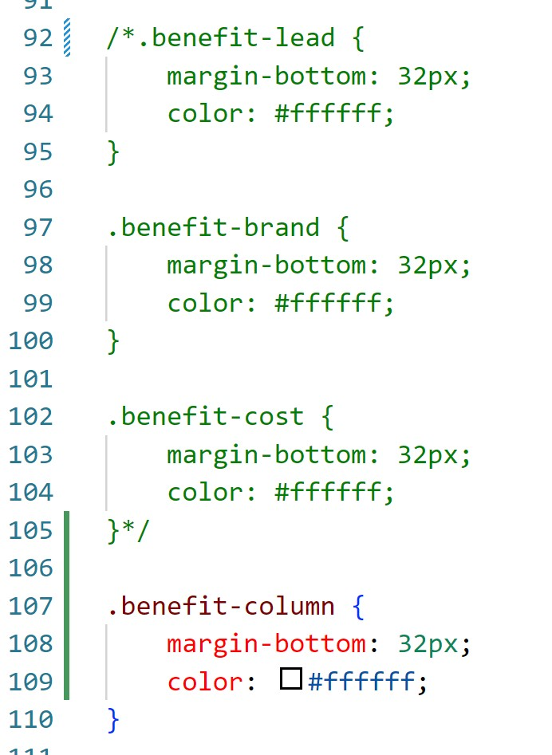

Horiseon-Challenge
Marketing agency has given code that they want to update to fit accessibility standards.

Refactoring throughout the app to clean up the code.

 elements were removed and replaces by <section><aside> and different <h> elements while maintaining the functionality and look of the application.
Links at the top of the page were repaired to bring the user to the appropriate section of the application.

The CSS was updated to remove repeat stylings and consolodate the code to be easier to read.

